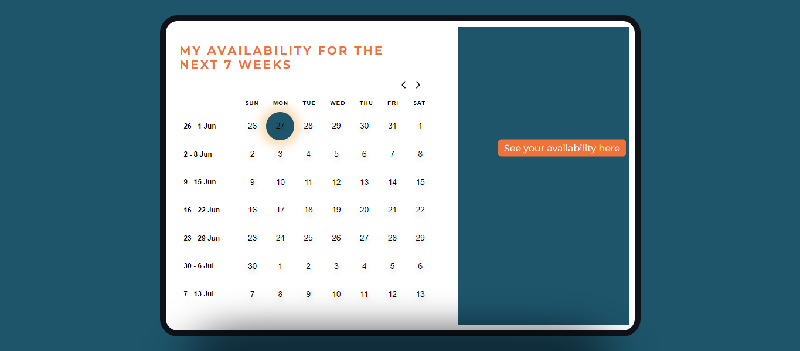

# Availability

This is a website for showing a users availability in time over a period of seven weeks which can be shared with friends to plan hangouts

## Built With

- Vite

- CSS

- Git and Github
  
- ReactJS
  
- Linters

## Deployment

 [Live version]( https://unfairadvantage.netlify.app/)

## Getting started

To get a local copy up and running follow these simple example steps

## Prerequisites

- You should have knowledge of REACT

- you should have  knowledge of CSS

 - Also,a basic knowledge of git and github

- A code editor: I used VScode for this project but you can use any code editor of your choice

## Author
### :female-doctor::skin-tone-5: Faith Usor
- GitHub: [@githubhandle](https://github.com/usorfaitheloho)
- Twitter: [@twitterhandle](https://twitter.com/faithusor16)
- LinkedIn: [LinkedIn](https://www.linkedin.com/in/faith-usor)

## Show your support
Give a :star:️ if you like this project!
## Acknowledgment
- Unfair Advantage
